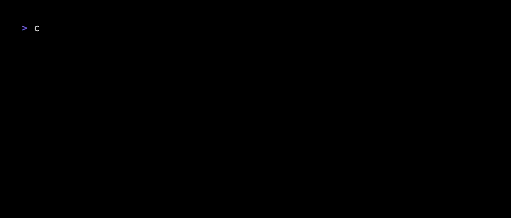

# Censys CLI

`cencli` brings the authority of internet intelligence to your terminal. Analyze assets, perform queries, and hunt threats, all from the command line.


The Censys CLI is available for free and paid users of the Censys Platform, with support for macOS, Linux, and Windows.

## Quick Start

Make sure you have [installed the binary](#installation) and it is on your `PATH`.

1. Run this command and follow the prompts to add your Censys Platform Personal Access Token

    ```bash
    $ censys config auth add
    ```

2. (Optional) Run this command and follow the prompts to add your Censys Platform Organization ID

    ```bash
    $ censys config org-id add
    ```

3. That's it! You can now perform asset lookups, searches, and more with the `censys` command.

    ```bash
    $ censys view 8.8.8.8
    ```

## Installation

Versioned releases of `cencli` for different platforms and architectures are available for download from the [releases page](https://github.com/censys/cencli/releases). After you've downloaded the binary, make sure you add it to your `PATH`.

### Supported Platforms

Each release includes pre-built binaries for the following operating systems and architectures:

| Operating System | Architecture | Platform Notes |
|------------------|--------------|----------------|
| **Linux** | `amd64` (x86_64) | Servers, cloud VMs (AWS/GCP/Azure), containers, WSL2 |
| **Linux** | `arm64` (aarch64) | AWS Graviton, ARM servers, Raspberry Pi 4+ |
| **macOS** | `amd64` (x86_64) | Intel-based Macs (pre-2020) |
| **macOS** | `arm64` (Apple Silicon) | M1/M2/M3/M4 Macs |
| **Windows** | `amd64` (x86_64) | Most Windows PCs and servers |
| **Windows** | `arm64` | ARM-based Windows devices |

All binaries are statically compiled with no external dependencies, making them portable and easy to deploy.

### Other Installation Methods

Alternatively, if you have Go 1.25+ installed, you can install `cencli` using the following command:

```bash
$ go install github.com/censys/cencli/cmd/cencli@latest
```

#### Homebrew

Coming soon, stay tuned!

#### Docker

Coming soon, stay tuned!

#### Build from source

1. Ensure you have Go 1.25+ installed

2. Clone the repository

    ```bash
    $ git clone https://github.com/censys/cencli.git
    $ cd cencli
    ```

3. Build the executable. This will produce a `censys` binary in the `bin/` directory

    ```bash
    $ make censys
    ```

4. Add this line to your shell configuration file (e.g. `~/.bashrc` or `~/.zshrc`)

    ```bash
    $ export PATH=$PATH:$(pwd)/bin
    ```

5. Verify the installation

    ```bash
    $ censys --help
    ```

## Usage

`cencli` supports various commands for accessing our internet map. You can run `censys --help` to see all available commands.

### Configuration

The `config` command allows you to manage your personal access tokens and organization IDs. See the [config command docs](./docs/commands/CONFIG.md) for more details.

### View

The `view` command allows you to fetch information about a particular host, certificate, or web property asset at a particular point in time. See the [view command docs](./docs/commands/VIEW.md) for more details.


You can also use the `--short` flag to render output using templates, which can be customized. See the [templating documentation](./docs/commands/view.md#templates) for more details.

### Search

The `search` command allows you to perform Censys Platform searches, either globally or within a collection. See the [search command docs](./docs/commands/SEARCH.md) for more details.


### Aggregate

The `aggregate` command allows you to perform aggregate queries, either globally or within a collection. See the [aggregate command docs](./docs/commands/AGGREGATE.md) for more details.


### Censeye

The `censeye` command allows you to perform a Censeye scan on a host. See the [censeye command docs](./docs/commands/CENSEYE.md) for more details.



### History

This is a WIP. See the [history command docs](./docs/commands/HISTORY.md) for more details.

### Other Commands

- `censys completion <bash|zsh|fish|powershell>`: Generate shell completion scripts
- `censys version`: Print version information

