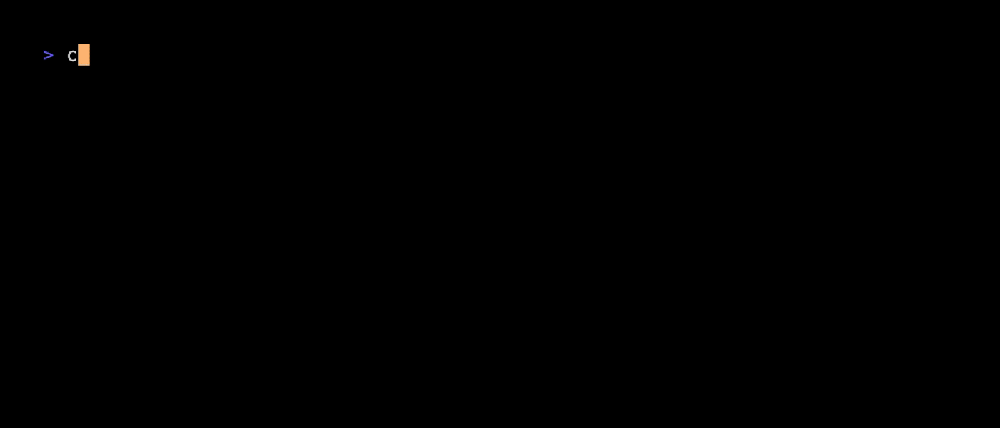

# Aggregate Command

The `aggregate` command allows you to aggregate results for a Platform search query.  This functionality is equivalent to the [Report Builder](https://docs.censys.com/docs/platform-report-builder#/) in the Censys Platform web UI.



## Usage

The aggregate command takes two required arguments:
1. **Query** - A Censys Query Language (CQL) expression to filter assets
2. **Field** - The field to aggregate by (e.g., `host.services.port`, `services.tls.version`)

```bash
$ censys aggregate "host.services.protocol=SSH" "host.services.port" # aggregate SSH services by port
$ censys aggregate "services.service_name:HTTP" "services.port" -n 10 # top 10 HTTP ports
```

## Flags

This section describes the flags available for the `aggregate` command. To see global flags and how they might affect this command, see the [global configuration docs](../GLOBAL_CONFIGURATION.md).

### `--collection-id`, `-c`

Aggregate within a specific collection instead of globally.

**Type:** `string` (UUID format)  
**Default:** none (aggregates globally)

```bash
$ censys aggregate "services.port: 443" "services.tls.version" --collection-id 550e8400-e29b-41d4-a716-446655440000
```

### `--org-id`

Specify the organization ID to use for the request. This overrides the default organization ID from your configuration.

**Type:** `string` (UUID format)  
**Default:** Uses the configured organization ID (or the free-user wallet if not configured)

```bash
$ censys aggregate "services.port: 443" "services.tls.version" --org-id 00000000-0000-0000-0000-000000000001
```

### `--num-buckets`, `-n`

The number of buckets (unique values) to return in the aggregation results. This controls how many of the top values are shown.

**Type:** `integer`  
**Default:** `25`  
**Minimum:** `1`  
**Maximum:** `10000`

```bash
$ censys aggregate "host.services.protocol=SSH" "host.services.port" --num-buckets 10
$ censys aggregate "services.service_name:HTTP" "services.port" -n 50
```

### `--count-by-level`, `-l`

Specifies which document level's count is returned per term bucket, primarily for nested fields. This is the same functionality available in the Count By dropdown in the Report Builder UI. 

When aggregating on nested fields like `host.services.port`:
- empty string (default) counts documents at the deepest level containing the field
- `.` (a period) counts root documents (e.g. counts matching 'host');
- `host.services` counts documents at the specified nested level.

**Type:** `string`  
**Default:** none (empty string)

```bash
$ censys aggregate "host.services.protocol=SSH" "host.services.port" --count-by-level "host.services" 
```

### `--filter-by-query`, `-f`

Controls whether aggregation results are limited to values that match the query. 

When true, only field values that satisfy the query constraints are included in aggregation counts. 

When false, aggregation includes all field values from records that match the query, even if those specific field values don't match the query constraints. 

For example, if the query is `host.services.protocol=SSH` and you are aggregating by `host.services.port` - when true, only shows SSH ports; when false, shows all ports on hosts that have SSH services.

**Type:** `boolean`  
**Default:** `false`

```bash
$ censys aggregate "host.services.port=22" "host.services.protocol" --filter-by-query
```

### `--interactive`, `-i`

Display results in an interactive table (TUI) that allows you to navigate, search, and explore the aggregation results.

**Type:** `boolean`  
**Default:** `false`

```bash
$ censys aggregate "host.services.port=22" "host.services.protocol" --interactive
```

**Note:** Cannot be used with `--raw`.

### `--raw`, `-r`

Output raw JSON data instead of a formatted table. This will respect the [output format](../GLOBAL_CONFIGURATION.md#--output-format--o) configuration.

**Type:** `boolean`  
**Default:** `false`

```bash
$ censys aggregate "host.services.port=22" "host.services.protocol" --raw
```

**Note:** Cannot be used with `--interactive`.

