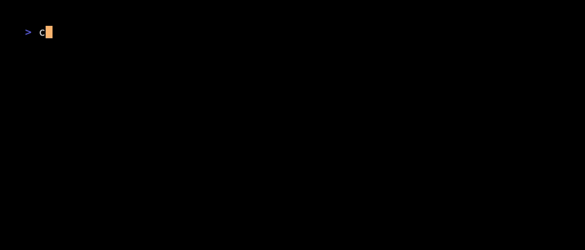

# CensEye Command

The `censeye` command helps you identify assets on the internet that share specific characteristics with a host you're investigating. It automatically extracts field-value pairs from a host and shows how many other assets share those same values, enabling you to pivot into related infrastructure and build threat hunting queries.

The output will include clickable queries that you can open in the Censys Platform web UI directly.


Note: this command is only available to users with the Threat Hunting feature enabled on their organization.

## Usage

The censeye command accepts a host identifier as a positional argument or via the `--input-file` flag:
- **Asset** - A host identifier (IP address)

```bash
$ censys censeye 8.8.8.8 # analyze a host
$ censys censeye --rarity-min 2 --rarity-max 100 1.1.1.1 # customize rarity bounds
$ censys censeye --input-file hosts.txt # read from file
$ echo "8.8.8.8" | censys censeye --input-file - # read from stdin
```

## What is CensEye?

CensEye analyzes a host and automatically generates queries based on unique characteristics found in the host's data. It then counts how many other internet-facing assets share each characteristic, helping you:

- Identify related infrastructure (e.g., assets using the same TLS certificate, favicon, or HTTP headers)
- Discover patterns across assets with similar characteristics
- Build threat hunting queries to track malicious infrastructure
- Investigate assets to determine shared usage or intent

The command marks queries as "interesting" when their counts fall within configured rarity bounds. This helps you focus on characteristics that are distinctive enough to be useful for threat hunting, but common enough to find related assets. The output will allow you to open the query in the Censys Platform web UI directly.

For detailed information about CensEye and its use cases, see the [CensEye documentation](https://docs.censys.com/docs/platform-threat-hunting-use-censeye-to-build-detections).

## Flags

This section describes the flags available for the `censeye` command. To see global flags and how they might affect this command, see the [global configuration docs](../GLOBAL_CONFIGURATION.md).

### `--org-id`

Specify the organization ID to use for the request. This overrides the default organization ID from your configuration.

**Type:** `string` (UUID format)  
**Default:** Uses the configured organization ID (or the free-user wallet if not configured)

```bash
$ censys censeye 8.8.8.8 --org-id 00000000-0000-0000-0000-000000000001
```

### `--input-file`, `-i`

Specify a file containing host identifiers to analyze. Use `-` to read from stdin. When this flag is used, the positional argument is optional.

**Type:** `string` (file path)  
**Default:** None (uses positional argument)

```bash
$ censys censeye --input-file hosts.txt
$ echo "8.8.8.8" | censys censeye --input-file -
$ cat hosts.txt | censys censeye -i -
```

**Note:** The file should contain one host identifier per line. Currently, only one host can be analyzed at a time.

### `--rarity-min`, `-m`

Minimum host count for a query to be marked as "interesting". Queries with counts below this threshold are still shown but not marked as interesting pivots.

**Type:** `integer`  
**Default:** `2`  
**Minimum:** `1`

```bash
$ censys censeye 8.8.8.8 --rarity-min 5
$ censys censeye 8.8.8.8 -m 5  # short form
```

### `--rarity-max`, `-M`

Maximum host count for a query to be marked as "interesting". Queries with counts above this threshold are still shown but not marked as interesting pivots.

**Type:** `integer`  
**Default:** `100`  
**Minimum:** `1`

```bash
$ censys censeye 8.8.8.8 --rarity-max 200
$ censys censeye 8.8.8.8 -M 200  # short form
```

**Note:** The `--rarity-min` value must be less than or equal to `--rarity-max`. Queries are marked as interesting when their count falls within the range `[rarity-min, rarity-max]` (inclusive).

CensEye also filters out results with a count of 1 or less to reduce noise in the output.

### `--interactive`, `-I`

Display results in an interactive table (TUI) that allows you to navigate through results and open queries directly in your browser.

**Type:** `boolean`  
**Default:** `false`

```bash
$ censys censeye 8.8.8.8 --interactive
$ censys censeye 8.8.8.8 -I  # short form
```

In interactive mode, you can:
- Navigate results with arrow keys or vim-style navigation (j/k)
- Press Enter to open a query in your default browser
- Search and filter within results


### `--include-url`

Include the `search_url` field in the output, which provides a direct link to view the query results in the Censys Platform web UI. This is particularly useful when using structured output formats (JSON, YAML) for scripting purposes.

**Type:** `boolean`  
**Default:** `false`

```bash
$ censys censeye 8.8.8.8 --output-format json --include-url
```

## Output Formats

The `censeye` command defaults to **`short`** output format, which displays results as a formatted table. You can override this with the `--output-format` flag (or `-O`).

**Default:** `short` (table view)  
**Supported formats:** `json`, `yaml`, `tree`, `short`

### Examples

```bash
# Default: formatted table view
$ censys censeye 8.8.8.8

# JSON output
$ censys censeye 8.8.8.8 --output-format json
$ censys censeye 8.8.8.8 -O json

# YAML output
$ censys censeye 8.8.8.8 --output-format yaml

# Interactive table (works with short format)
$ censys censeye 8.8.8.8 --interactive
```

**Note:** The `--interactive` flag provides an enhanced interactive table view when using the `short` output format.

## Understanding the Output

By default, CensEye displays results in a formatted table with two columns:

- **Count** - The number of internet-facing assets that match this query
- **Query** - A clickable CensEye-generated query (marked with `*` if interesting)

Queries marked with `*` are considered "interesting" because their counts fall within your configured rarity bounds.

You can also view results in an interactive table (TUI), or just use the raw JSON output.

### Table


### Interactive Table


### Raw Data




